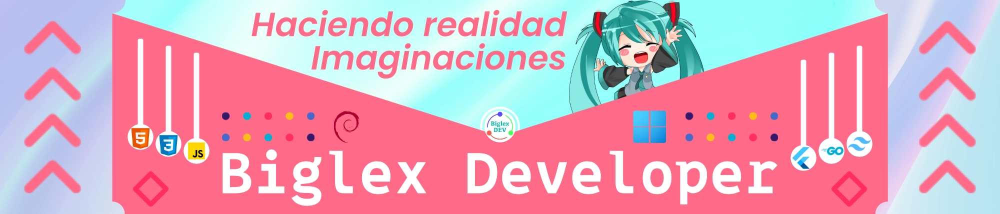
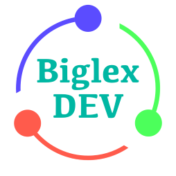

<link rel="stylesheet" type='text/css' href="https://cdn.jsdelivr.net/gh/devicons/devicon@latest/devicon.min.css" />

👋 Hola mundo, soy **Biglex J**

  

Creador de contenido, desarrollador de software (Web, Mobile & Desktop) y explorador del lado creativo de la tecnología.  
Me apasiona transformar ideas en proyectos reales: aplicaciones nativas, asistentes de IA locales, experiencias web inmersivas y herramientas multimedia.

Con experiencia en frontend, backend y desarrollo multiplataforma, mezclo código, arte y creatividad como si fueran ingredientes de un ramen 🍜.  
Mi visión es **crear tecnología accesible, estética y con personalidad**.

---

### ✨ Proyectos Destacados

| Proyecto | Descripción | Stack Tecnológico |
| :--- | :--- | :--- |
| 🌌 **[Aurora Blog](https://github.com/biglexj/Aurora-Blog-Public)** | Sitio web oficial con ElyVerso (WebGL 3D), Ely Intelligence (IA) y hub multimedia. | Astro 5, React 19, Tailwind 4, ASP.NET Core |
| 🎨 **[Lienzo Gallery](https://github.com/biglexj/Lienzo--Gallery)** | Galería nativa multimedia y reproductor de música con interfaz fluida y moderna. | Kotlin, Jetpack Compose, Material 3, Android |
| 🌙 **[Luna Fetch](https://github.com/biglexj/Luna---Fetch)** | Descargador multiplataforma de audio y video impulsado por yt-dlp y FFmpeg. | Kotlin & Compose Multiplatform (Win/Linux/Android) |
| 🎙️ **[LyraFlow](https://github.com/biglexj/LyraFlow)** | Dictado por voz inteligente con atajo global e integración de Gemini API / Whisper local. | Kotlin & Compose Multiplatform, Gemini, Whisper |
| 🔊 **[WinTTS](https://github.com/biglexj/WinTTS)** | Motor de síntesis de voz (TTS) 100% local y offline con limpieza de Markdown. | C#, WPF, .NET 10, Windows API |
| 🎹 **[Ely-Tesia](https://github.com/biglexj/Ely-Tesia)** | Visualizador MIDI y herramienta interactiva de práctica musical estilo Synthesia. | Kotlin & Compose Multiplatform, MIDI Sync |

---

### 🎨 Temas & Personalización

| Repositorio | Descripción | Entorno / Herramienta |
| :--- | :--- | :--- |
| 🎨 **[Miku Code Theme](https://github.com/biglexj/miku-code-theme)** | Tema inspirado en Hatsune Miku con tonos turquesa vibrantes. | VS Code |
| 🔮 **[Hypr Ely Neon](https://github.com/biglexj/hypr-ely-neon)** | Tema neón personalizado para SDDM y entorno Hyprland. | Linux / QML |
| 💻 **[Terminal Windows Theme](https://github.com/biglexj/Terminal-Windows-Theme)** | Tema y configuración de estilo para Windows Terminal. | Windows Terminal |
| 🐧 **[Terminal Linux Theme](https://github.com/biglexj/Terminal-Linux-Theme)** | Personalización estética y temas para la terminal de Linux. | Linux / Shell |
| ⚙️ **[Nilesoft Shell Conf](https://github.com/biglexj/NilesoftShell-Conf)** | Menú contextual personalizado para Windows con Nilesoft Shell. | Windows Shell |
| 📦 **[Windows Dotfiles](https://github.com/biglexj/windows-dotfiles)** | Scripts y configuraciones de personalización para Windows. | Windows / Python |
| 📦 **[Linux Dotfiles](https://github.com/biglexj/biglexj-dotfiles)** | Archivos de configuración y dotfiles personales para Linux. | Linux / Shell |

---

- 🔭 Actualmente trabajando en **Lienzo Gallery, Aurora Blog v10 y herramientas con IA local**.
- 🌱 Aprendiendo y mejorando en **Kotlin Multiplatform, C# (.NET 10), Astro 5, Python y Compose UI**.
- ⚡ Fun fact: Programar escuchando MIKU es lo máximo 🎶.

---

<h3 align="left">🌐 Conecta conmigo:</h3>

  

---

<h3 align="left">📊 Actividad:</h3>

  

  
---

<h3 align="left">⚙️ Lenguajes y Herramientas:</h3>
<table>
    <tr>
        <td><b>Lenguajes & Mobile:</b></td>
        <td></td>
    </tr>
    <tr>
        <td><b>Frontend & Frameworks:</b></td>
        <td></td>
    </tr>
    <tr>
        <td><b>Backend & IA:</b></td>
        <td></td>
    </tr>
    <tr>
        <td><b>DevOps / Hosting:</b></td>
        <td></td>
    </tr>
    <tr>
        <td><b>Sistemas Operativos:</b></td>
        <td></td>
    </tr>
    <tr>
        <td><b>Software Creativo:</b></td>
        <td></td>
    </tr>
</table>

---

🌸 *“El código también puede ser arte, solo hay que darle estilo.”* 🎨  

[Biglex J](https://github.com/biglexj)
