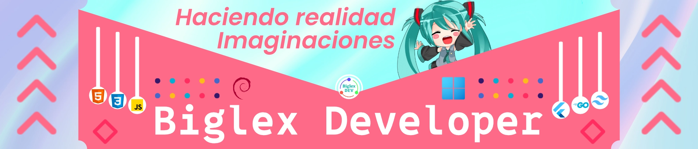

<link rel="stylesheet" type='text/css' href="https://cdn.jsdelivr.net/gh/devicons/devicon@latest/devicon.min.css" />

👋 Hola mundo, soy Biglex J

Creador de contenido, desarrollador web y explorador del lado creativo de la tecnología.  
Me encanta transformar ideas en proyectos reales, desde páginas web hasta aplicaciones, pasando por diseños y experimentos con IA.  

✨ Mis proyectos principales:  
- **Proyecto Prisma** → Mi VTuber con integración interactiva.  
- **Proyecto Aurora** → Mi sitio web oficial.  

Con experiencia en frontend y backend, mezclo código, arte y creatividad como si fueran ingredientes de un ramen 🍜.  
Mi visión es **crear tecnología accesible, estética y con personalidad**.  

---

- 🔭 Actualmente trabajando en **mi portafolio web y proyectos personales**.  
- 🌱 Aprendiendo y mejorando en **JavaScript, Python, C# y DevOps ligero (Pocketbase, Netlify, etc.)**.  
- ⚡ Fun fact: Programar escuchando MIKU es lo máximo 🎶.  

---

<h3 align="left">🌐 Conecta conmigo:</h3>

<a href="https://www.youtube.com/@biglexj" target="blank"><i align="center" class="devicon-youtube-plain colored" height="40" width="60"></i></a>
<a href="https://www.linkedin.com/in/biglexj/" target="blank"><i align="center" class="devicon-linkedin-plain colored" height="40" width="60"></i></a>
<a href="https://biglexj.net.pe" target="blank"><i align="center" class="devicon-html5-plain colored" height="40" width="60"></i></a>

  

---

<h3 align="left">📊 Actividad:</h3>

  

  <a href="https://github.com/biglexj" style="text-decoration:none;">
    biglexj
  </a>

---

<h3 align="left">⚙️ Lenguajes y Herramientas:</h3>
<table>
    <tr>
        <td><b>Frontend:</b></td>
        <td></td>
    </tr>
    <tr>
        <td><b>Backend:</b></td>
        <td></td>
    </tr>
    <tr>
        <td><b>Bases de datos:</b></td>
        <td></td>
    </tr>
    <tr>
        <td><b>DevOps / Hosting:</b></td>
        <td></td>
    </tr>
    <tr>
        <td><b>Sistemas Operativos:</b></td>
        <td></td>
    </tr>
    <tr>
        <td><b>Lenguaje de diseño:</b></td>
        <td></td>
    </tr>
    <tr>
        <td><b>Software creativo:</b></td>
        <td></td>
    </tr>
</table>

---

🌸 *“El código también puede ser arte, solo hay que darle estilo.”* 🎨 

[Biglex J](https://github.com/biglexj)
